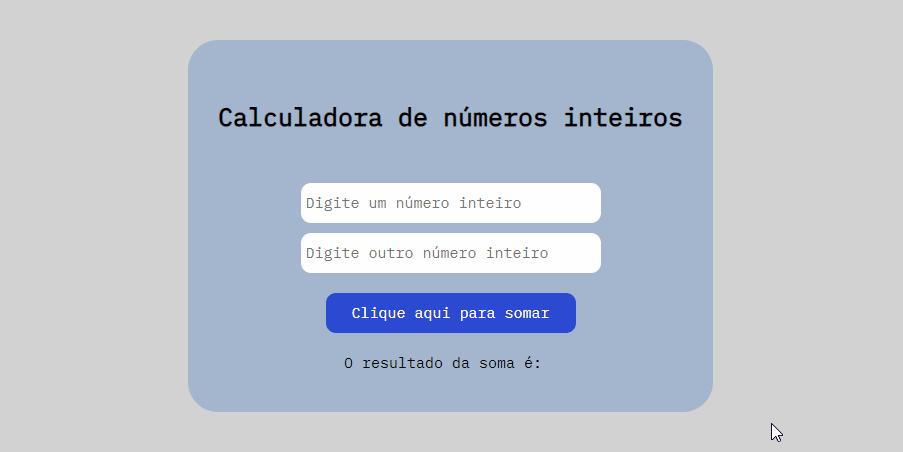

# O projeto

Este projeto foi criado para o curso QA Engineer - Analista de softwares da Ultima School. 
Nele foi utilizado as linguagens HTML5, CSS3 e JavaScript. 

## Observações

Ainda irei melhorar este projeto, fazendo com que seja possível somar números decimais. 

Abaixo tela do projeto:

